# PCB design walk-through with KiCad

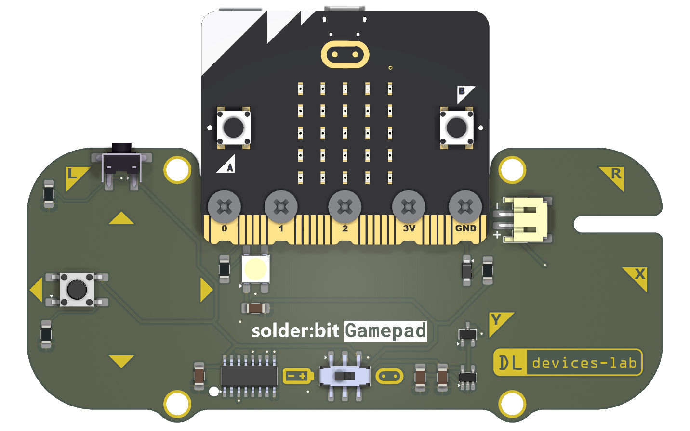

In this tutorial, your task is to complete the design of the solder:bit Gamepad! The design is missing several buttons, LEDs, and passive components (resistors and capacitors). Help @mac-aron finish the design before he sends it off to the PCB manufacturer!

The solder:bit Gamepad is a kit for learning to solder with surface-mount (SMT) components. You can find out more about the solder:bit Gamepad in [this GitHub repository](https://github.com/devices-lab/solderbit-gamepad).

## Getting started

1. Download or clone this repository.
2. Inside the [kicad](./kicad/) folder, open `solderbit-gamepad.kicad_pro`.
3. Begin with the Schematic Editor 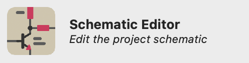

   Add all the missing symbols and wire them up. You can find hints in grey boxes to show you which components are missing.

   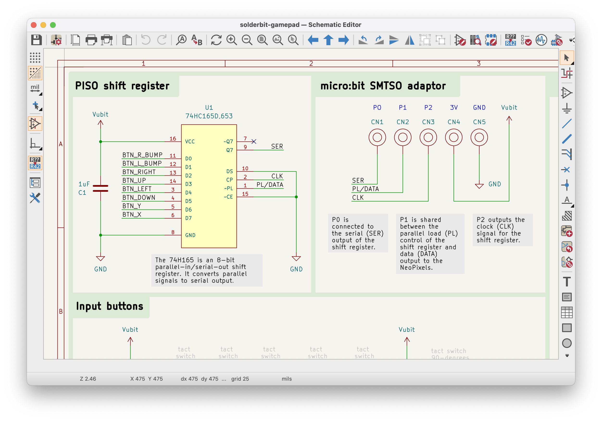

4. Next, transition over to the PCB Editor 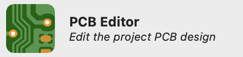

   Bring in your changes from the schematic, place component footprints, and route them with traces. There are placeholders on the `User.Drawings` layer to help you with positioning the footprints.

   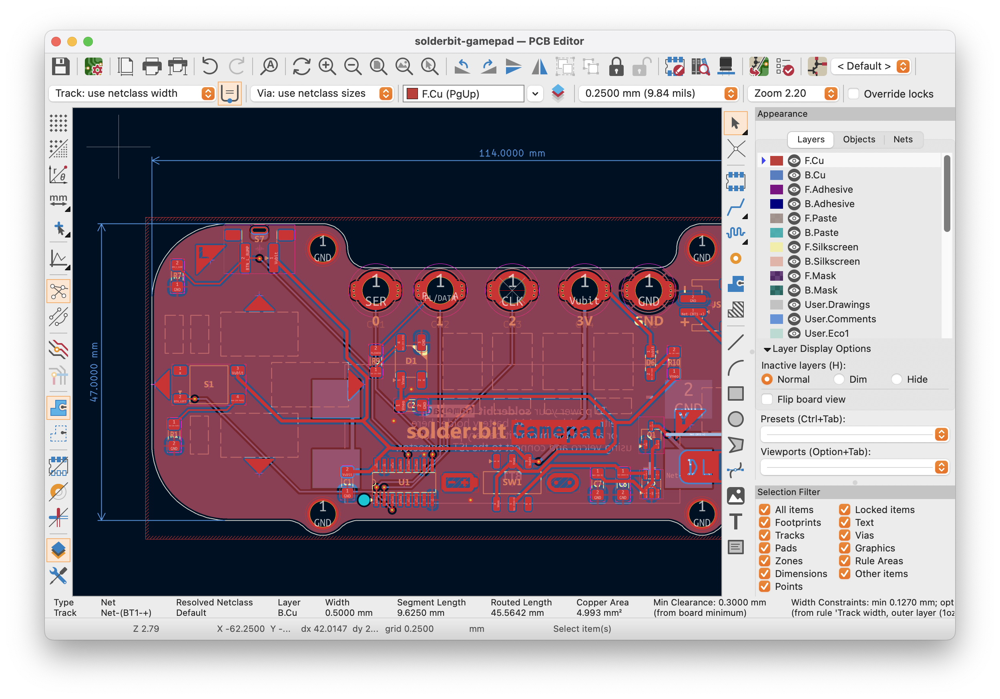

   You can preview your PCB in 3D by pressing Alt+3 (or Option+3 on a Mac), or by going to `View` &#8594; `3D Viewer` in the PCB Editor.

   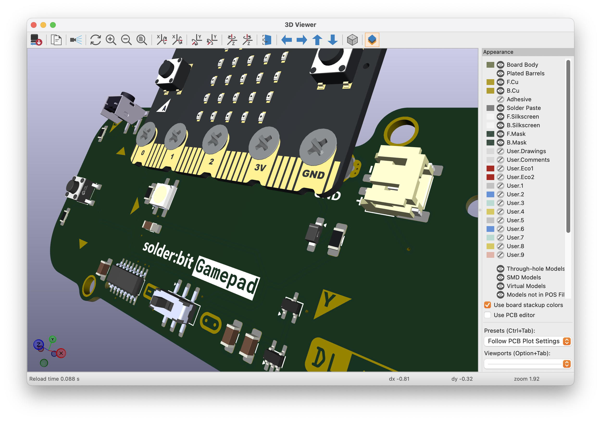

5. Generate fabrication files for manufacturing and some nice renders!

> [!NOTE]
> The steps above are just to give you an idea of the plan for the tutorial session. Detailed design steps will be demonstrated live during the session. If you have any questions, please ask the presenter or one of the assistants in the room!

> [!TIP]
> Our aim is to introduce you to PCB design, so don't worry about finishing everything perfectly. Feel free to reuse any part of this project to explore further, and if you'd like to keep learning, there are plenty of great tutorials and videos online to take you further.

## What components do I need to add?

As previously mentioned, your task is to add in the missing components. That includes the following:

| Part name/value    | How many do I need to add? | Schematic symbol                                                                                          | 3D preview                                                                                   |
| ------------------ | -------------------------- | --------------------------------------------------------------------------------------------------------- | -------------------------------------------------------------------------------------------- | --- |
| Tactile switch     | 5                          | 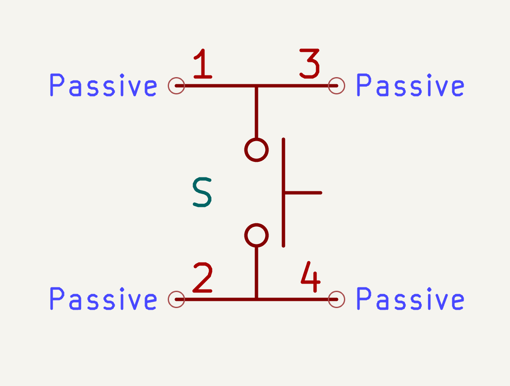                  | 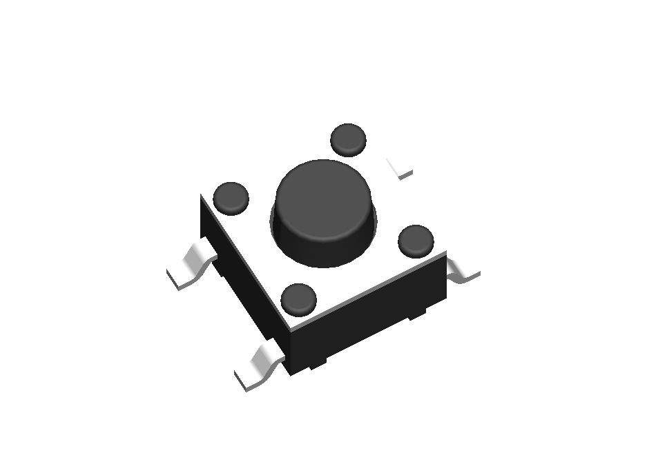                  |
| 90° tactile switch | 1                          | 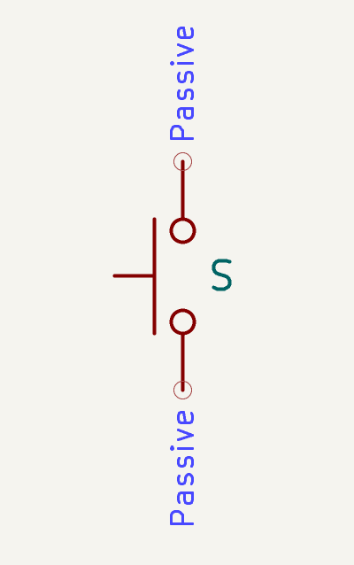 | 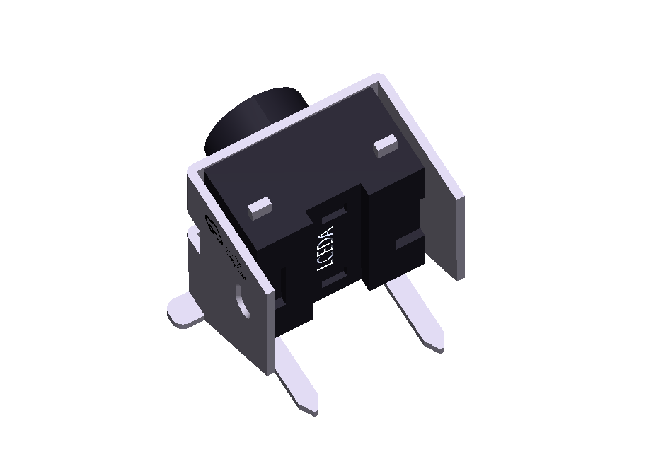 |
| 100 kΩ resistor    | 6                          | 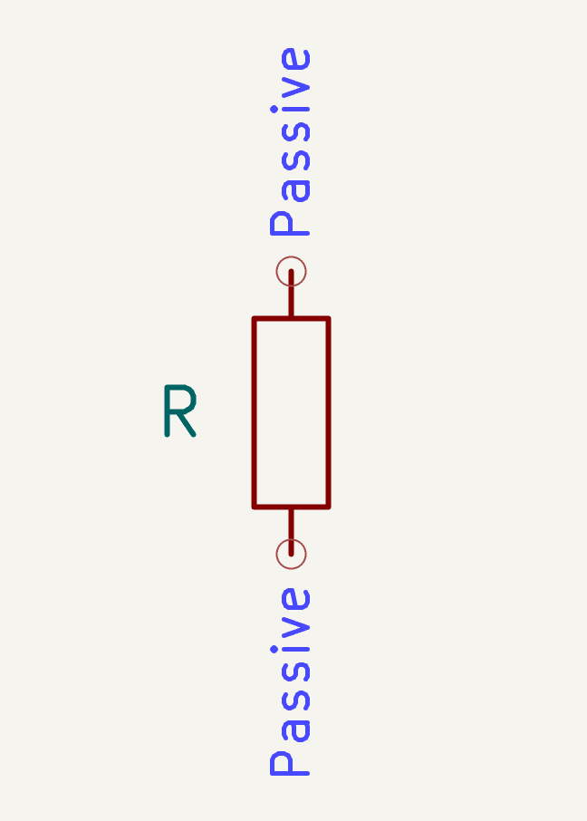                        | 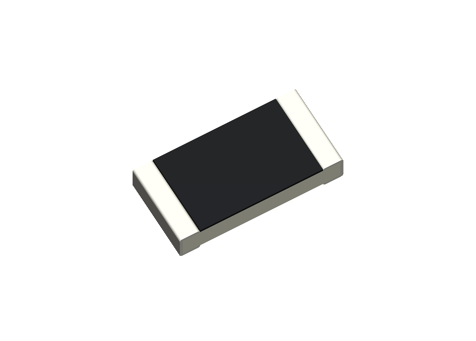                        |
| WS2812B (NeoPixel) | 4                          | 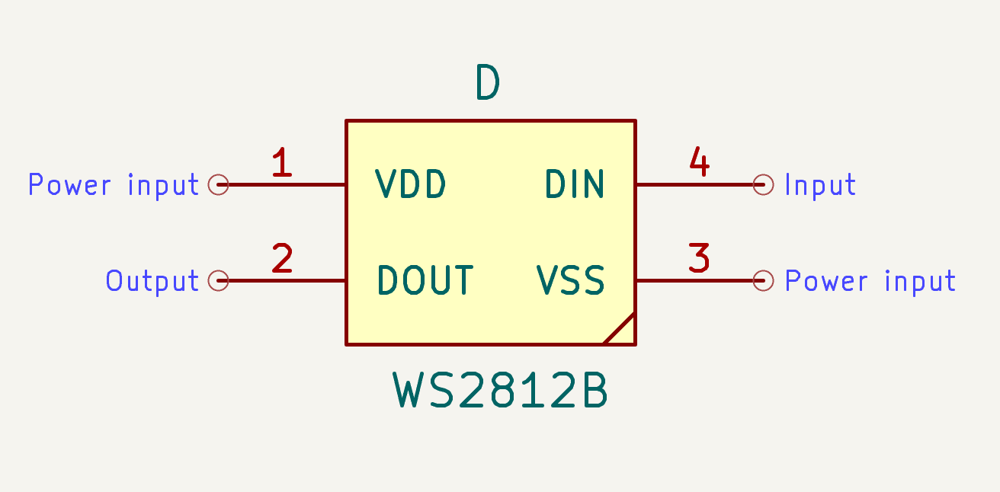                          | 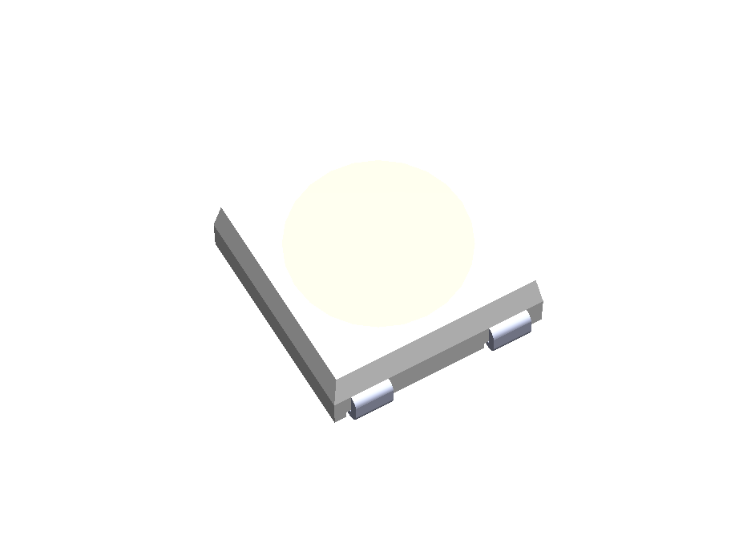                          |
| 1 µF capacitor     | 4                          | 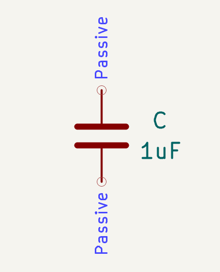                      | 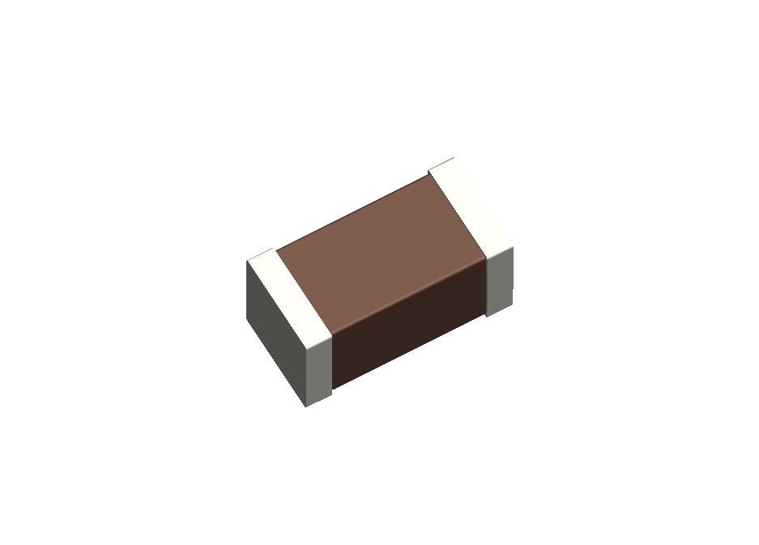                      |     |

## Useful resources

- Check out [KiCad documentation](https://docs.kicad.org/) to get started
- Check out the `reference` folder in this repository, it contains datasheets for some of the components you will be working with
- Check out the full design in the [solder:bit Gamepad GitHub repository](https://github.com/devices-lab/solderbit-gamepad)

## Credits

Special thanks to [Dr John Vidler](https://github.com/JohnVidler), everyone at the [Devices Lab](https://www.devices-lab.org/), and to [pro² network+](https://prosquared.org/) for organising the summer schools. Also thank you to all the summer school delegates who discovered a new skill in PCB design.

## License

This project is licensed under the GNU General Public License (GPL), version 3. This license allows you to use, modify, and redistribute the solder:bit Gamepad and any derivative works, but all such derivatives must also be licensed under the GPL.

The GPL ensures that all modifications and improvements to the solder:bit Gamepad remain free and open for the public benefit. By using this project, you agree to abide by its terms and conditions.

For more details on the license, please see the [LICENSE](/LICENSE) file included in this repository.

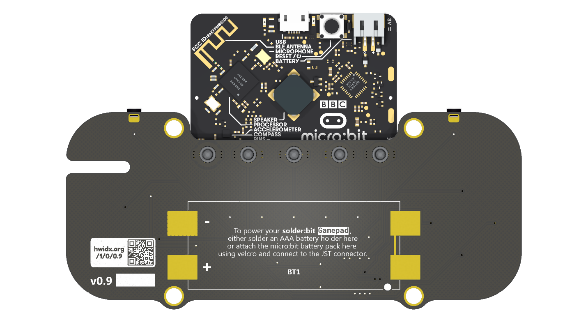
